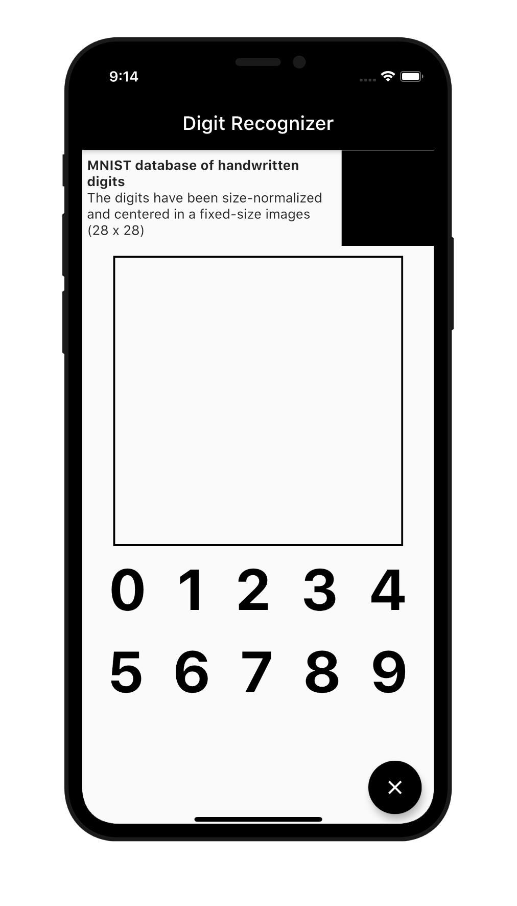
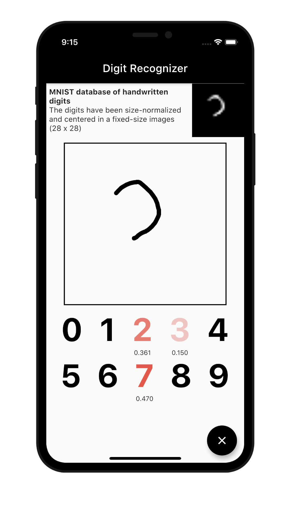
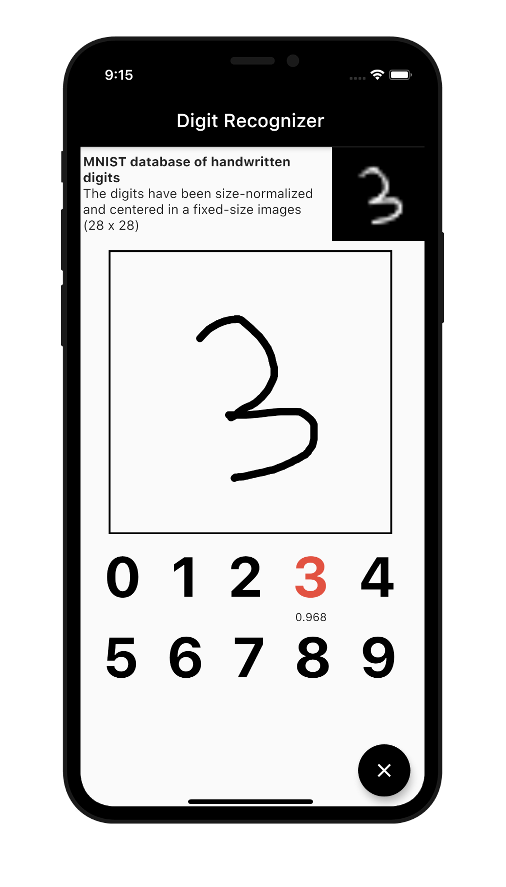
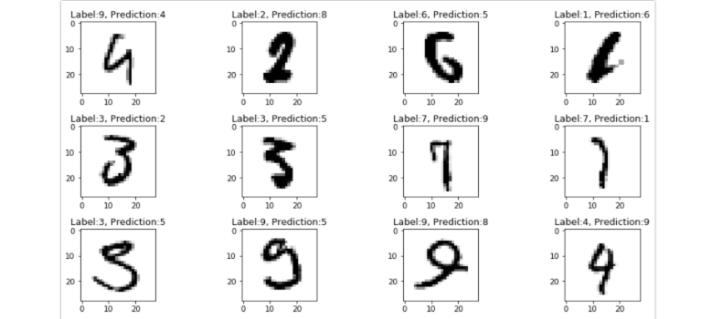

# Flutter Tensorflow Lite Digit Recognizer

Date: 2020

Digit Recognizer using Flutter, Tensorflow Lite and MNIST Data

   

 

## Dataset
* [Kaggle](https://www.kaggle.com/code/puzzleleaf/introduction-to-cnn-keras-0-997-top-6/notebook)

## Package
* [tflite](https://pub.dev/packages/tflite) : A Flutter plugin for accessing TensorFlow Lite API

